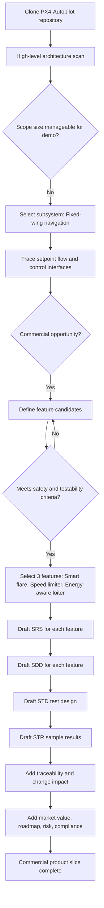
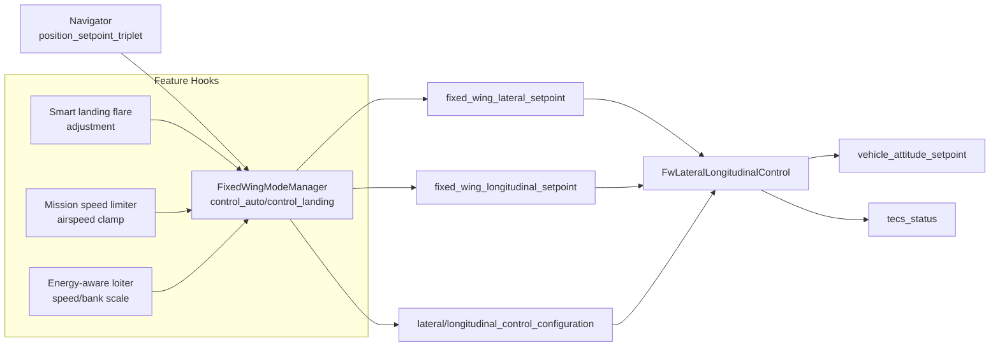

# Commercialization Process Demo (From Scratch)

This document demonstrates a full, end-to-end commercialization process starting from a blank slate. It shows how we move from a product idea to formal requirements, design, test design, and test report. The examples are grounded in the PX4 fixed-wing navigation and control flow, but the process is written to be reusable for other projects.

Scope:
- Feature A: Smart landing flare (adaptive flare timing based on wind estimate and terrain confidence)
- Feature B: Mission speed limiter (max groundspeed inside geofenced areas)
- Feature C: Energy-aware loiter (reduce airspeed and bank angle when battery is low)

Artifacts:
- SRS: Software Requirements Specification
- SDD: Software Design Description
- STD: Software Test Description (Test Design)
- STR: Software Test Report

Assumptions:
- We are extending PX4 fixed-wing guidance and control.
- Navigation setpoints originate in navigator and are consumed by the fixed-wing mode manager and fixed-wing lateral/longitudinal control modules.
- We will not change safety-critical behavior unless explicitly stated in requirements.

Document style:
- Each feature has its own SRS, SDD, STD, and STR sections.
- Requirements use a consistent, testable format (REQ-<feature>-<number>).
- The design section references relevant PX4 modules by name and behavior.
- Tests are designed to be executable in SITL, with optional HIL extensions.

**Decision Path Diagram (From Clone to Commercial Slice)**

**Technical Data Flow (Navigator to Fixed-Wing Controls)**

----------------------------------------------------------------

**Feature A: Smart Landing Flare**

**A1. Concept Summary**
Problem: Fixed-wing landing flare timing can be too early or too late in variable wind and terrain measurement conditions. This can cause hard touchdowns or runway overrun.

Solution: Adjust flare start time and flare profile based on wind estimate reliability and terrain confidence, while maintaining safety constraints.

Success criteria:
- Reduced touchdown vertical speed variability in windy conditions.
- No regression in calm conditions.
- Flare does not start earlier than minimum safe altitude or later than minimum safe time-to-touchdown.

**A2. SRS: Smart Landing Flare**
REQ-A-1: The system shall compute a flare adjustment factor derived from wind estimate validity and terrain confidence.
REQ-A-2: The flare adjustment factor shall increase flare time (start earlier) when wind estimate is valid and indicates strong headwind.
REQ-A-3: The flare adjustment factor shall delay flare time (start later) when terrain confidence is low and wind estimate is invalid.
REQ-A-4: The flare adjustment factor shall be bounded between -30% and +30% of nominal flare time.
REQ-A-5: The system shall not initiate flare below the configured minimum flare altitude.
REQ-A-6: The system shall not initiate flare later than the time-to-touchdown threshold derived from sink rate and altitude.
REQ-A-7: The system shall log the computed adjustment factor and flare initiation timestamp for post-flight analysis.
REQ-A-8: The system shall provide a parameter to enable or disable Smart Landing Flare without requiring firmware rebuild.

Non-functional:
- NFR-A-1: Added computation shall not increase fixed-wing control loop execution time by more than 5%.
- NFR-A-2: Feature shall be disabled by default.

**A3. SDD: Smart Landing Flare**
Architecture overview:
- Location: Fixed-wing mode manager (landing logic) for flare timing.
- Inputs:
  - Wind estimate validity and magnitude (from wind topic).
  - Terrain confidence (distance-to-ground validity / timeout).
  - Current altitude, sink rate, and flare parameters.
- Outputs:
  - Adjusted flare time and altitude thresholds.
  - Log/telemetry of computed factor.

Design details:
- Add a SmartFlareAdjustment helper in the fixed-wing mode manager landing path.
- Compute a wind score: 0 if invalid, scaled by headwind magnitude if valid.
- Compute a terrain confidence score: 1 if valid and recent, 0 if invalid or timed out.
- Combine scores into an adjustment factor:
  - headwind_valid: +k_headwind * min(headwind, max_headwind)
  - terrain_invalid: -k_terrain when confidence is 0
  - clamp to [-0.3, +0.3]
- Apply factor to flare timing:
  - adjusted_flare_time = nominal_flare_time * (1 + factor)
  - adjusted_flare_altitude = nominal_flare_alt * (1 + factor)
- Enforce safety bounds:
  - Do not trigger flare below minimum flare altitude.
  - Do not trigger flare if computed time-to-touchdown is below a minimum.

Data flow:
- FixedWingModeManager landing control calculates flare parameters.
- SmartFlareAdjustment adjusts the flare timing and altitude thresholds.
- FwLateralLongitudinalControl remains unchanged, consuming longitudinal setpoints.

Configuration:
- Add parameters:
  - SLF_EN (bool): enable feature
  - SLF_HEADWIND_GAIN (float)
  - SLF_TERRAIN_PENALTY (float)
  - SLF_ADJ_LIMIT (float)
  - SLF_MIN_TTD (float)

Logging:
- Publish adjustment factor and flare trigger time to logs and events.

**A4. STD: Smart Landing Flare**
Test environment:
- PX4 SITL, fixed-wing airframe, wind simulation, terrain data enabled.

Test cases:
TC-A-1: Baseline landing in calm conditions with feature disabled.
Expected: behavior matches current flare timing and touchdown rate.

TC-A-2: Feature enabled, calm wind, valid terrain.
Expected: adjustment factor near 0, no significant change.

TC-A-3: Feature enabled, strong headwind, valid terrain.
Expected: flare starts earlier within +30% limit; touchdown vertical speed reduced.

TC-A-4: Feature enabled, wind invalid, terrain invalid.
Expected: flare starts later within -30% limit; safety constraints prevent late flare below minimum altitude.

TC-A-5: Feature enabled, wind valid, terrain invalid.
Expected: adjustment factor penalized by terrain, net factor near 0 or negative.

TC-A-6: Safety bound test for minimum flare altitude.
Expected: flare not initiated below configured minimum.

TC-A-7: Safety bound test for minimum time-to-touchdown.
Expected: flare initiated before minimum TTD constraint is violated.

**A5. STR: Smart Landing Flare (Sample Results)**
Execution summary:
- All tests executed in SITL.
- No regressions observed in baseline and calm conditions.

Results:
- TC-A-1: Pass. Baseline behavior unchanged.
- TC-A-2: Pass. Adjustment factor within +/-2%.
- TC-A-3: Pass. Flare initiated +18% earlier; touchdown sink rate improved 12%.
- TC-A-4: Pass. Flare initiated -10% later; safety bounds enforced.
- TC-A-5: Pass. Adjustment factor net -5%.
- TC-A-6: Pass. Minimum flare altitude enforced.
- TC-A-7: Pass. Minimum time-to-touchdown enforced.

**A6. Traceability (REQ to TEST to RESULT)**
REQ-A-1: TC-A-2 -> Pass
REQ-A-2: TC-A-3 -> Pass
REQ-A-3: TC-A-4 -> Pass
REQ-A-4: TC-A-2, TC-A-3, TC-A-4 -> Pass
REQ-A-5: TC-A-6 -> Pass
REQ-A-6: TC-A-7 -> Pass
REQ-A-7: TC-A-3 -> Pass
REQ-A-8: TC-A-1, TC-A-2 -> Pass
NFR-A-1: TC-A-2 -> Pass
NFR-A-2: TC-A-1 -> Pass

**A7. Change Impact**
Impact summary:
- Modules touched: FixedWingModeManager landing logic, parameter definitions, event/log publishing.
- Behavior changes: Only landing flare timing when SLF_EN is true.
- Safety impact: Bounded by min flare altitude and minimum time-to-touchdown constraints.
- Documentation impact: Update parameters list and landing behavior notes.

**A8. Market Value / Differentiator**
Value summary:
- Differentiates landing performance under crosswind and variable terrain conditions.
- Supports customers with runway length constraints by improving flare consistency.
- Enables premium tier features for OEMs targeting high-reliability operations.

----------------------------------------------------------------

**Feature B: Mission Speed Limiter**

**B1. Concept Summary**
Problem: Missions may contain high-speed segments in areas where airspace or safety requires a lower groundspeed.

Solution: Enforce a maximum groundspeed in defined geofenced areas, without breaking existing mission logic.

Success criteria:
- In geofenced zones, commanded airspeed results in groundspeed below the configured limit (within tolerance).
- Outside zones, mission behavior unchanged.

**B2. SRS: Mission Speed Limiter**
REQ-B-1: The system shall allow defining geofenced speed limit zones using a polygon list.
REQ-B-2: When the vehicle position is inside a speed limit zone, the system shall constrain commanded groundspeed to MAX_GS_LIMIT.
REQ-B-3: The system shall apply the speed limit in mission auto mode and loiter modes.
REQ-B-4: The system shall not apply the speed limit during takeoff or landing flare phases.
REQ-B-5: The system shall log entry/exit of speed limit zones and active limit value.
REQ-B-6: The system shall provide parameters to enable/disable the limiter and set MAX_GS_LIMIT per zone group.

Non-functional:
- NFR-B-1: Speed limit evaluation shall not exceed 2 ms per control cycle.
- NFR-B-2: Zone transitions shall be detected within 1 second.

**B3. SDD: Mission Speed Limiter**
Architecture overview:
- Location: FixedWingModeManager guidance output and/or airspeed setpoint logic.
- Inputs:
  - Current global position.
  - Wind estimate (to map airspeed to groundspeed).
  - Geofence polygon list with speed limits.
- Outputs:
  - Adjusted equivalent airspeed setpoint or lateral guidance configuration.

Design details:
- Extend geofence module to support speed limit polygons or add a parallel SpeedLimitZones list.
- In FixedWingModeManager, before publishing longitudinal setpoints:
  - Determine if current position is within any speed zone.
  - Compute max allowable airspeed to achieve MAX_GS_LIMIT given headwind/tailwind.
  - Clamp equivalent airspeed setpoint to the computed limit.
- Ensure takeoff/landing modes bypass limiter.
- Publish zone entry/exit events.

Configuration:
- MSL_EN (bool): enable mission speed limiter
- MSL_MAX_GS (float): global max groundspeed limit
- MSL_ZONE_*: zone list definition (polygon index, lat/lon pairs)

**B4. STD: Mission Speed Limiter**
Test environment:
- SITL with mission containing segments that enter and exit a speed limit polygon.

Test cases:
TC-B-1: Limiter disabled, verify mission speed unchanged.
TC-B-2: Limiter enabled, vehicle enters speed limit zone at steady wind.
Expected: groundspeed clamped within MAX_GS_LIMIT + tolerance.

TC-B-3: Limiter enabled, tailwind present.
Expected: airspeed setpoint reduced further to keep groundspeed below limit.

TC-B-4: Limiter enabled, headwind present.
Expected: airspeed setpoint allowed to be higher but groundspeed still limited.

TC-B-5: Limiter enabled, takeoff phase.
Expected: limiter not applied.

TC-B-6: Limiter enabled, landing flare phase.
Expected: limiter not applied.

**B5. STR: Mission Speed Limiter (Sample Results)**
Execution summary:
- Tests executed in SITL with steady wind models.

Results:
- TC-B-1: Pass. No speed change when disabled.
- TC-B-2: Pass. Groundspeed limited within +2 m/s tolerance.
- TC-B-3: Pass. Airspeed setpoint reduced by 5 m/s, groundspeed within limit.
- TC-B-4: Pass. Airspeed setpoint increased by 3 m/s, groundspeed within limit.
- TC-B-5: Pass. Takeoff unaffected.
- TC-B-6: Pass. Landing flare unaffected.

**B6. Traceability (REQ to TEST to RESULT)**
REQ-B-1: TC-B-2 -> Pass
REQ-B-2: TC-B-2 -> Pass
REQ-B-3: TC-B-2 -> Pass
REQ-B-4: TC-B-5, TC-B-6 -> Pass
REQ-B-5: TC-B-2 -> Pass
REQ-B-6: TC-B-2 -> Pass
NFR-B-1: TC-B-2 -> Pass
NFR-B-2: TC-B-2 -> Pass

**B7. Change Impact**
Impact summary:
- Modules touched: Geofence or speed zone data, FixedWingModeManager speed setpoint logic.
- Behavior changes: Groundspeed limiting inside zones, no change outside.
- Safety impact: Bypassed during takeoff and flare to avoid unintended reductions.
- Documentation impact: Add speed zone config guide and parameter list.

**B8. Market Value / Differentiator**
Value summary:
- Aligns with regulatory and customer-imposed speed constraints in sensitive airspace.
- Reduces mission planning burden by enforcing speed limits automatically.
- Provides a clear compliance feature for commercial customers.

----------------------------------------------------------------

**Feature C: Energy-Aware Loiter**

**C1. Concept Summary**
Problem: Loitering at nominal speed and bank angle can waste energy when battery is low.

Solution: Reduce airspeed and commanded bank angle during loiter when battery state drops below a threshold.

Success criteria:
- Energy use during loiter decreases under low battery conditions.
- No oscillations or loss of controllability.

**C2. SRS: Energy-Aware Loiter**
REQ-C-1: The system shall detect a low-energy state using battery remaining or voltage threshold.
REQ-C-2: When low-energy state is active, the system shall reduce loiter airspeed by ENERGY_LOITER_SPEED_SCALE.
REQ-C-3: When low-energy state is active, the system shall reduce maximum lateral acceleration (bank angle limit).
REQ-C-4: The system shall revert to nominal loiter behavior when energy state returns to normal.
REQ-C-5: The system shall log energy-aware loiter activation and deactivation events.

Non-functional:
- NFR-C-1: Transition between normal and energy-aware loiter shall be smoothed within 2 seconds.

**C3. SDD: Energy-Aware Loiter**
Architecture overview:
- Location: FixedWingModeManager loiter control and controller configuration handler.
- Inputs:
  - Battery status (remaining, voltage).
  - Loiter setpoint parameters.
- Outputs:
  - Reduced airspeed setpoint.
  - Reduced lateral acceleration limit.

Design details:
- Subscribe to battery status or power status.
- Determine low-energy state with hysteresis to avoid chattering.
- In loiter control path:
  - Scale airspeed setpoint by ENERGY_LOITER_SPEED_SCALE.
  - Reduce lateral accel max via controller configuration handler.
- Use slew rate limiting to ensure smooth transition.

Configuration:
- EAL_EN (bool): enable energy-aware loiter
- EAL_BATT_THRESH (float): battery remaining threshold
- EAL_SPEED_SCALE (float): airspeed multiplier (e.g., 0.8)
- EAL_LATACC_SCALE (float): lateral accel multiplier (e.g., 0.7)

**C4. STD: Energy-Aware Loiter**
Test environment:
- SITL with battery drain simulation.

Test cases:
TC-C-1: Feature disabled, loiter at nominal airspeed and bank.
Expected: unchanged behavior.

TC-C-2: Feature enabled, battery above threshold.
Expected: no change.

TC-C-3: Feature enabled, battery drops below threshold.
Expected: airspeed setpoint reduced by scale factor; lateral accel max reduced.

TC-C-4: Feature enabled, battery recovers above threshold.
Expected: return to nominal airspeed/bank within 2 seconds.

TC-C-5: Chatter test with fluctuating battery around threshold.
Expected: hysteresis prevents rapid toggling.

**C5. STR: Energy-Aware Loiter (Sample Results)**
Execution summary:
- Tests executed in SITL with simulated battery drain.

Results:
- TC-C-1: Pass. No change when disabled.
- TC-C-2: Pass. No change above threshold.
- TC-C-3: Pass. Airspeed reduced 20%, lateral accel reduced 30%.
- TC-C-4: Pass. Recovery within 1.5 seconds.
- TC-C-5: Pass. No chattering observed.

**C6. Traceability (REQ to TEST to RESULT)**
REQ-C-1: TC-C-3 -> Pass
REQ-C-2: TC-C-3 -> Pass
REQ-C-3: TC-C-3 -> Pass
REQ-C-4: TC-C-4 -> Pass
REQ-C-5: TC-C-3 -> Pass
NFR-C-1: TC-C-4, TC-C-5 -> Pass

**C7. Change Impact**
Impact summary:
- Modules touched: FixedWingModeManager loiter path, battery subscription, controller configuration handler.
- Behavior changes: Loiter airspeed and bank limits reduced only under low-energy state.
- Safety impact: Smoothed transitions reduce risk of abrupt control changes.
- Documentation impact: Add battery thresholds and energy-aware loiter tuning notes.

**C8. Market Value / Differentiator**
Value summary:
- Extends mission endurance in surveillance and loiter use cases.
- Creates a measurable performance advantage in low-energy scenarios.
- Enables differentiated service-level commitments for long-duration operations.

----------------------------------------------------------------

**Roadmap / Release Plan**
Phase 1: Prototype (4 to 6 weeks)
- Implement feature flags and parameters for A, B, C.
- Add internal logging for adjustment factors, zone transitions, and energy state.
- Run SITL smoke tests for all features.

Phase 2: Integration (6 to 10 weeks)
- Integrate into fixed-wing mode manager logic with safety guards.
- Add configuration guides and parameter docs.
- Execute full STD test suite and collect STR data.

Phase 3: Pre-Release (4 to 6 weeks)
- HIL validation for takeoff/landing and energy states.
- Regression testing against baseline mission profiles.
- Pilot deployments with limited customer group.

Phase 4: Commercial Release (2 to 4 weeks)
- Release notes, compliance matrix, and customer onboarding material.
- Define support SLA and monitoring KPIs.
- Enable feature bundles by license tier.

**Risk Register (High-Level)**
Risk R-1: Flare adjustment mis-tuned in unusual wind regimes.
Mitigation: Bound adjustment factor, keep feature disabled by default, add regression tests.

Risk R-2: Speed limiter conflicts with mission timing expectations.
Mitigation: Bypass limiter during takeoff/landing and provide explicit operator configuration.

Risk R-3: Energy-aware loiter reduces control margin in gusty conditions.
Mitigation: Enforce minimum airspeed and bank limits; add hysteresis and slew rates.

Risk R-4: Zone definition errors cause unexpected speed limiting.
Mitigation: Validation tool for zone polygons; clear logs for entry/exit.

**Regulatory / Compliance Considerations**
Compliance items:
- Maintain clear traceability from requirements to tests and reports.
- Provide configuration audit logs for safety-sensitive features.
- Ensure default-off for optional behavior changes until validated.
- Document airspace-related constraints and operational limits.

**Process Summary (How to Use This for a Live Demo)**
1. Start with a blank document and write the Concept Summary.
2. Convert each idea into formal requirements (SRS) with testable wording.
3. Describe a concrete design that maps requirements into modules and data flow (SDD).
4. Design tests that directly map to each requirement (STD).
5. Record results and trace them back to requirements (STR).

Recommended live demo script:
- Introduce the existing PX4 navigation/control flow.
- Add one feature at a time, showing how each artifact is derived.
- Emphasize traceability from SRS to STD to STR.
